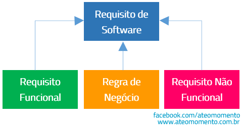

# Requirements Gathering

## Introduction

Requirements gathering is a fundamental step in the software development process. It involves identifying, analyzing, documenting, and validating the needs and expectations of users and other stakeholders. In that context, requirements serve as the foundation of a successful project, guiding the entire development cycle — from design to testing and maintenance. Its construction can envolve multiple types of thinking and can be divided in two major categories: **functional** (related to the platform's features) and **non-functional** (related to system behavior and quality). As a consequence of linking both divisions with the right business logic (as shown in the figure below), software requirements are created and will explain essential features and qualities the platform must present.

     
    Figure 1: Software requirements <a href="https://www.ateomomento.com.br/o-que-e-requisito-funcional//" target="_blank">Software Requirement</a>

### Functional Requirements

Functional requirements describe the specific actions the system must perform. They are directly related to user-visible features and the operations the system must carry out. Typical examples include login, registration, content creation, and user interactions.

### Non-Functional Requirements

Non-functional requirements describe the **qualities of the system**, such as performance, security, availability, and usability. Although they do not represent direct features, they are essential to ensuring a good user experience and the overall success of the product.

## Importance of Requirements Mapping

Mapping requirements is a key step to ensure alignment between what users expect and what will actually be developed. A well-defined set of requirements helps avoid rework, facilitates effort estimation, guides development, and serves as a foundation for validation and testing. Additionally, it allows for **prioritized planning**, helping the team focus on what is most critical to the initial success of the project.

---

## Functional Requirements (in order of priority)

### 1. User Registration  
Allow users to create an account and access the platform via email, social networks, or another secure authentication method.

### 2. Place List Creation  
Enable users to create personalized lists of places they wish to visit, organizing them by categories or personal preferences.

### 3. Review Submission  
Allow users to post reviews and comments about places they’ve visited, assigning ratings and sharing experiences.

### 4. Follower System  
Allow users to follow each other, creating a social network based on tastes, recommendations, and shared experiences.

### 5. Search and Filters  
Provide advanced search tools and filters (by type of place, location, rating, etc.) to help users find establishments more precisely.

### 6. Custom Lists  
Offer features to create customized lists beyond the standard categories, such as “best Italian restaurants in São Paulo” or “ideal date spots.”

### 7. Personalized Recommendations  
Generate automatic suggestions of places based on user interests, browsing behavior, and past reviews.

### 8. Business Profiles  
Allow bars and restaurants to create and personalize their own profiles, including descriptions, photos, menus, operating hours, etc.

### 9. Access to Metrics and Data  
Enable establishments to view engagement metrics related to their profiles, such as number of views, clicks, and reviews received.

### 10. Creation of Targeted Campaigns  
Provide businesses with tools to create marketing campaigns targeted at specific audiences based on location and user behavior.

---

## Non-Functional Requirements

### NFR01 - High Availability  
The system must be available at least 99.5% of the time, ensuring continuous access for users and establishments.

### NFR02 - Low Latency  
System interactions (such as searches or list creation) must respond in less than 1 second in 95% of cases.

### NFR03 - Data Security  
All sensitive data (such as passwords and personal information) must be encrypted and securely stored.

### NFR04 - Scalability  
The application must be capable of handling a gradual increase in users and interactions without significant performance degradation or the need for major restructuring.

### NFR05 - Responsiveness  
The platform must seamlessly adapt to different screen sizes and devices, ensuring good usability across smartphones, tablets, and desktops.

### NFR06 - Traceability  
Key user and business actions (such as campaign creation or list deletion) must be logged for monitoring, security, and to assist in identifying potential issues or errors.

## References

- Ventura, Plinio. O que é Requisito Funcional. Até o Momento, 2016. Available at: https://www.ateomomento.com.br/o-que-e-requisito-funcional/. Accessed on: May 1, 2025
