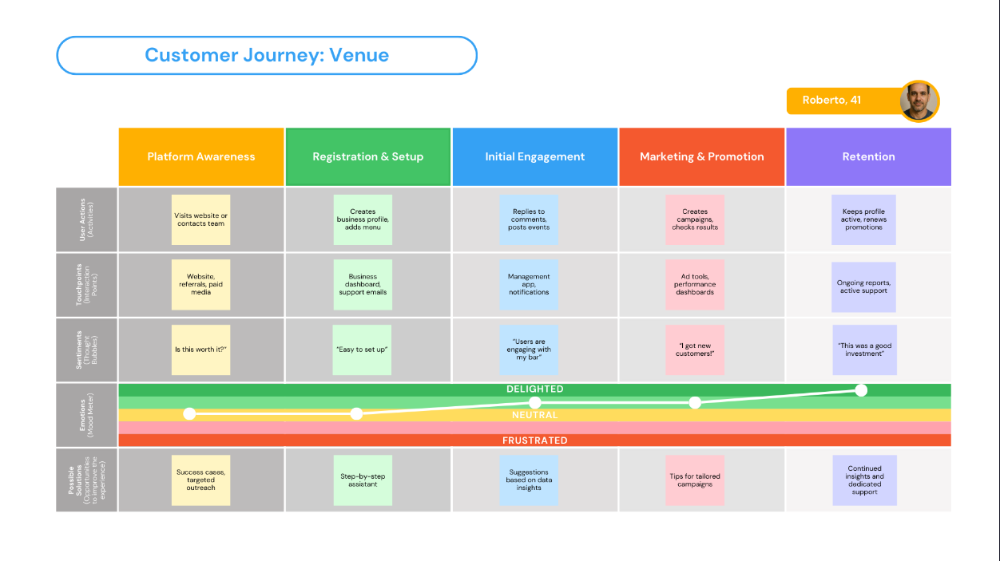

# User Journeys

## Introduction

User journeys are visual or narrative representations that describe a persona’s experience when interacting with a product or service, from the first contact to the completion of a specific goal. In the context of user-centered software development, they are essential for understanding users' emotions, motivations, expectations, and potential frustrations at each touchpoint with the platform. 

Unlike navigation flows or technical specifications, journeys focus on the user's perspective, exploring the context in which the application is used, their needs at each stage, and the paths they take to achieve value. This helps identify opportunities for improvement, critical pain points, and key moments of delight or abandonment. 

As such, mapping user journeys allows designers, developers, and stakeholders to make more informed and empathetic decisions, ensuring that the product truly meets user expectations.

## Structure

An effective user journey is composed of different elements that together provide a comprehensive and empathetic view of the persona's experience over time. These elements are organized into phases and layers that detail both practical actions and subjective feelings. Below are the main parts that structure a user journey, based on the visual model used:

### 1. Journey Phases

The phases represent the main stages of the user’s interaction with the product or service. Each phase marks a significant transition in the user’s behavior or relationship with the solution, such as: discovery, sign-up, exploration, continuous use, problem resolution, and retention. Defining these steps helps organize the journey in a logical and chronological manner.

### 2. User Actions

This line describes the activities performed by the user in each phase of the journey. These include observable behaviors and decisions, such as “download the app,” “create an account,” or “rate a venue.” This layer reveals the effort required by the user to progress through their journey.

### 3. Touchpoints

Touchpoints are the channels and interfaces where interactions occur, such as app screens, notifications, emails, or customer support. Mapping these points is essential to understand where and how the user connects with the system, and where friction or moments of delight might occur.

### 4. Sentiments

This layer represents what the user may be thinking at each phase. These are subjective expressions that reflect doubts, expectations, or concerns, such as “is this app trustworthy?” or “I couldn’t find what I was looking for.” These insights are valuable for understanding the reasoning behind user actions.

### 5. Emotions

This component focuses on the user’s emotional state throughout the journey. Represented by a visual line (mood meter), this element shows fluctuations between frustration, neutrality, and delight. This emotional view helps identify moments of vulnerability or satisfaction during the experience.

### 6. Possible Solutions

Finally, this layer proposes solutions or improvements for each phase of the journey. Based on the identified pain points, it’s possible to suggest concrete actions in design, communication, or technology that make the experience smoother, more pleasant, and more effective for the user.

## Solution journeys

### User

     
    Figure 1: User Journey

The "Client" journey represents Lucas, a 23-year-old user exploring new places through the platform. His experience starts in the "Discovery" phase when he hears about the platform via ads or friends. Curious, he thinks “Seems interesting”, feeling neutral but open. In "Onboarding", he quickly signs up and logs in — “Easy to sign up” — through the app or website, receiving a welcome email. During "Exploring", Lucas browses venues and reads reviews, excited by the variety: “So many options!”. Notifications and filters help him refine his experience. In "Interaction", he follows users, likes posts, and comments, enjoying the community aspect — “I like this user’s reviews.” Finally, in "Retention", he uses personalized recommendations and builds a venue list, saying, “I always find cool new places.” Enhancements such as tutorials, smart suggestions, gamification, and rewards help deepen his engagement and encourage long-term use.

### Venue

     
    Figure 2: Venue Journey

The journey for the "Venue" persona follows Roberto, a 41-year-old bar owner, from first contact with the platform to long-term retention. It begins at the "Platform Awareness" stage, where Roberto visits the website or contacts the team after seeing ads or referrals. Initially unsure — wondering “Is this worth it?” — his emotions are neutral. During "Registration & Setup", he creates his business profile and uploads a menu using the dashboard, finding it “Easy to set up”. As he moves into "Initial Engagement", he starts replying to comments and posting events, feeling reassured: “Users are engaging with my bar.” Tools like the management app and notifications support this phase. In "Marketing & Promotion", he launches campaigns and checks performance metrics, thrilled to see results: “I got new customers!” Finally, in the "Retention" stage, he keeps his profile active and renews promotions, supported by regular reports and customer support. He concludes, “This was a good investment.” Key improvements across the journey include guided onboarding, data-based suggestions, and ongoing support.