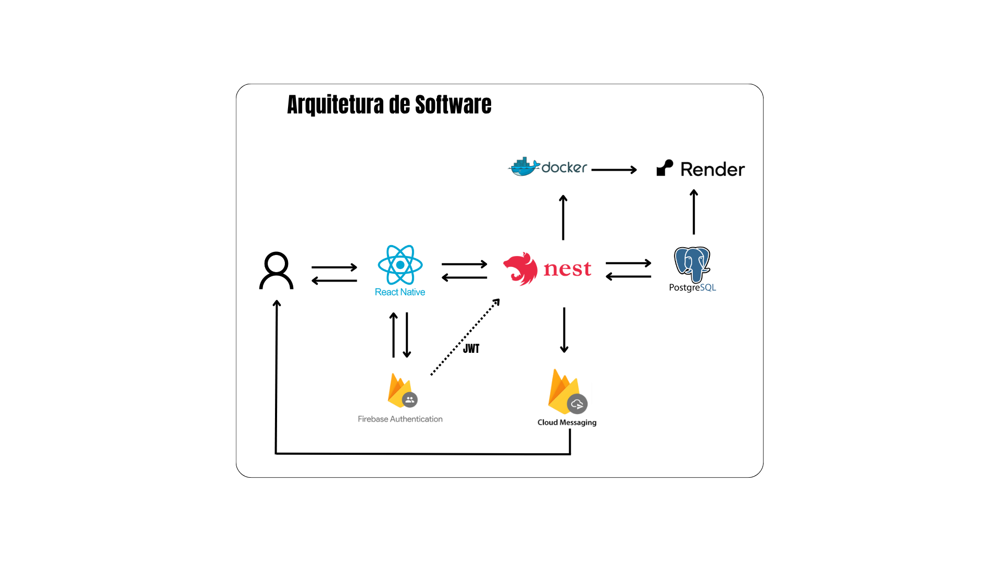

# Software Architecture

## Introduction

Software architecture is the fundamental organizational structure of a system, composed of its components, their relationships, and the principles that guide its design and evolution. A well-designed architecture serves as a map that guides development, facilitates technical decisions, promotes scalability, and improves maintainability throughout the project lifecycle.

In the context of this project, clearly defining the architecture is essential to ensure that the solution is scalable, secure, and easy to evolve as new features and users are added. However, it is important to emphasize that the architecture outlined and presented in this document refers to the development of the MVP (Minimum Viable Product) and focuses on ease of use, user experience, and time optimization, aiming for the best quality at the lowest possible cost.

---

## Architecture Components

The system architecture is composed of several fundamental components:

- **Mobile Frontend**: The frontend is the graphical interface with which users interact. It is responsible for displaying information, capturing user input (such as registrations, reviews, or comments), navigating between screens, and interacting with the backend via API calls. This layer must be responsive, intuitive, and efficiently integrated with backend services.

- **Backend/API**: The backend is the logical and central layer of the system. It receives requests from the app, processes data, applies business rules, accesses the database, and returns appropriate responses. It is also responsible for validating users, managing permissions, maintaining data integrity, and handling flows such as registrations, posts, searches, reviews, and user interactions.

- **Database**: The database is where all the structured information of the system is stored. This includes data from users, venues, reviews, comments, activity history, session tokens, and more. It must ensure consistency, integrity, and allow for efficient queries, even as data and user volume grow.

- **Authentication**: This service is responsible for identifying and authenticating system users. It allows people to log in securely using email, social networks, or other credentials. It also issues tokens that are used to validate access to protected backend routes, ensuring that only authorized users can perform certain actions.

- **Push Notification Service**: This component is used to send messages directly to users' mobile devices. Notifications can be triggered by events such as new interactions, promotions, comments, invites, or other relevant activities within the social network. The goal is to keep users engaged and informed in real time, even when the app is not open.

- **API Hosting**: For the backend to be publicly accessible, it must be hosted in a cloud environment. Hosting allows the application to run on a server with availability, security, and scalability. This layer receives app requests, distributes the load efficiently, and ensures the system continues working properly even with increased user demand.

- **Containerization**: Containerization is a technique used to package the backend and its auxiliary services (such as the database) into isolated, standardized environments. This ensures the system works the same way on different machines, simplifies development, testing, and automated deployments, and improves control over dependencies and configurations.

---

## Architecture

     
    Figure 1: Architecture

Considering the expected user journey and the defined architecture, as shown in the figure above (Figure 1), when a user interacts with the application, the flow begins at the mobile interface built with React Native. Upon opening the app, the user logs in using Firebase Authentication, which securely and scalably manages the entire authentication process.

Once authenticated, the user can send or request information through the app. These requests are routed to the backend developed with NestJS, which runs in the cloud using the Render hosting service, packaged and managed with Docker.

The backend processes the requests, applies business rules, and interacts with the PostgreSQL database, also hosted on Render. When necessary, the backend also communicates with Firebase Cloud Messaging to send push notifications directly to the user’s device, such as reminders or real-time updates.

At the end of each request, data is returned to the mobile app, completing the interaction cycle.

## Chosen Technologies

### Frontend: React Native (with Expo)
- **Why it was chosen**
  - Allows Android and iOS development with a single codebase.
  - Large community, ready-to-use components, and excellent integration with modern libraries.
  - Easy MVP iteration with Expo, including QR code testing.
  - Some previous experience in Inteli projects.

- **Benefits**
  - Fast development.
  - Native-like experience at lower cost.
  - Compatible with push notifications, Firebase Auth, and other SDKs.

---

### Backend: NestJS (Node.js + TypeScript)
- **Why it was chosen**
  - Modular architecture inspired by Angular, with strong dependency injection usage.
  - Native support for TypeScript, testing, and scalability.
  - Ideal for clean, well-structured development with growth potential.
  - Some previous experience in Inteli projects.
- **Benefits**
  - Easy integration with relational databases (PostgreSQL via Prisma or TypeORM).
  - Supports WebSockets, JWT, middleware, and third-party services.
  - Promotes best architectural practices (Domain-driven, Clean Architecture, etc.).

---

### Database: PostgreSQL
- **Why it was chosen**
  - Open-source, robust, and highly reliable relational database.
  - Supports complex queries and extensions like PostGIS (useful for geolocation).
- **Benefits**
  - Ideal for complex and relational data modeling.
  - Strong data consistency.
  - Compatible with Prisma and other modern ORMs.

---

### Authentication: Firebase Auth (or Auth0)
- **Why it was chosen**
  - Quick to integrate, supports login via Google, Apple, email/password, etc.
  - Out-of-the-box user management.
  - Compatible with mobile and backend SDKs.
- **Benefits**
  - Reduces development time.
  - Built-in security.
  - Easily scalable.
- **Alternative:** Auth0 offers more control and customization, being a good option for future versions.

---

### Cloud and Storage: Firebase
- **Services used:**
  - **Firebase Storage** for images.
  - **Firebase Cloud Messaging (FCM)** for push notifications.
  - **Firebase Analytics** (optional) for usage metrics.
- **Benefits**
  - Scalable with a generous free tier for MVPs.
  - High integration with mobile apps and backend.
  - Simplified management via console.

---

### Containerization: Docker
- **Why Docker?**
  - Creates isolated and reproducible environments for development and deployment.
  - Allows backend, database, and other services to run together consistently.
- **Benefits**
  - Avoids "it works on my machine" problems.
  - Facilitates testing, CI/CD, and automated deployment.
  - Compatible with Render, AWS, etc.

---

### API Hosting: Render
- **Why Render?**
  - PaaS platform that simplifies continuous deployment via GitHub.
  - Integrated PostgreSQL database.
  - Supports Docker and autoscaling.
- **Benefits**
  - Easy to use, especially for MVPs.
  - Dashboard with logs, metrics, and database management.
- **Alternative:** Railway offers more control and performance in some cases.

---

## References

- EXPO. Expo – An open-source platform for making universal native apps. Available at: https://expo.dev. Accessed on: May 29, 2025.

- NODE.JS. Node.js. Available at: https://nodejs.org. Accessed on: May 29, 2025.

- DOCKER. Docker – Empowering app development for developers. Available at: https://www.docker.com. Accessed on: May 29, 2025.

- REACT NATIVE. React Native – Create native apps for Android and iOS using React. Available at: https://reactnative.dev. Accessed on: May 29, 2025.

- NESTJS. NestJS – A progressive Node.js framework. Available at: https://nestjs.com. Accessed on: May 29, 2025.

- POSTGRESQL. PostgreSQL – The world’s most advanced open source relational database. Available at: https://www.postgresql.org. Accessed on: May 29, 2025.

- FIREBASE. Firebase – Build and run successful apps. Available at: https://firebase.google.com. Accessed on: May 29, 2025.

- RENDER. Render – The modern cloud for developers. Available at: https://render.com. Accessed on: May 29, 2025.