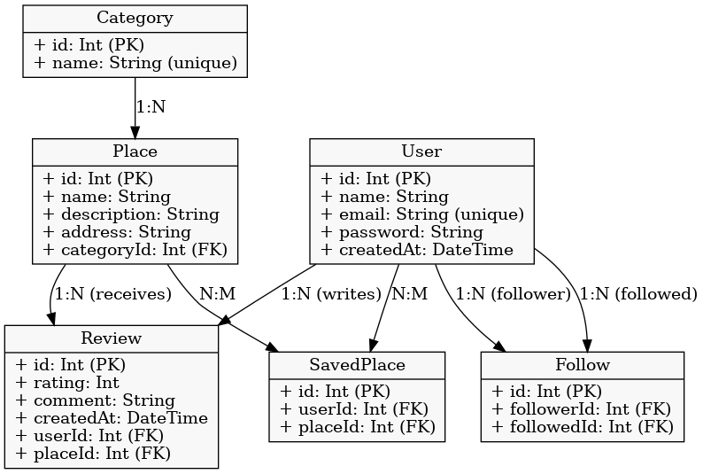

# Backend Documentation – Noma Social Network

## Introduction

This backend was developed as part of the **MVP (Minimum Viable Product)** for the Noma social network, with the main goal of building a **solid, simple foundation that meets the project's core needs**, while allowing **future scalability and easy maintenance**.

The focus at this stage was to cover only the **key features of the application**, ensuring that users have **a smooth and functional experience across the main user journeys and interactions within the platform**.

---

## Technologies Used

### NestJS

A Node.js framework for building scalable and modular applications. Chosen for its **clean architecture**, **TypeScript support**, and **easy organization of modules, controllers, and services**, making it ideal for MVP development.

### Prisma ORM

An ORM used for communication between the backend and the database. Prisma was selected for its **intuitive interface**, **automatic TypeScript typings generation**, and **ease of maintenance and database migration**.

### PostgreSQL

A relational database chosen for its **stability**, **flexibility in data modeling**, and **strong performance for projects expecting future growth**.

### Postman

Tool used to **test and validate API endpoints** during the development process.

---

## Database Logical Model

The logical database model, as shown in Figure 1, was designed to represent the **core entities of the Noma platform** and their relationships. For this MVP phase, the focus was on **covering only the essential features**, with a **simple yet scalable structure**.

<div align="center">
    <br>
    <span>Figure 1: Database Model</span>
</div>

---

### Entities and Covered Features

The MVP covers the following entities and their main functionalities:

| Entity        | Main Features                                                        |
|---------------|----------------------------------------------------------------------|
| `User`        | Profile creation, search by ID, and follower system                  |
| `Place`       | Establishment registration and information retrieval                 |
| `Review`      | Review registration with rating, comment, and spending value         |
| `Follow`      | User-to-user connection (follow and list followers/following)        |
| `Category`    | Establishment categorization to facilitate browsing and discovery    |
| `Saved Places`| Saving places (favorites and wishlists)                              |

---

### Endpoints by Entity

#### User

- `POST /user` – Create a new user  
- `GET /user/:id` – Get user by ID  
- `DELETE /user/:id` – Delete user  
- `GET /user/:id/followers` – List followers  
- `GET /user/:id/following` – List users being followed  

---

#### Place

- `POST /place` – Create a new place  
- `GET /place/:id` – Get place by ID  
- `GET /place/:id/reviews` – List reviews associated with a place  

---

#### Review

- `POST /review` – Create a review  
- `GET /review/:id` – Get review by ID  
- `DELETE /review/:id` – Delete review  

---

#### Category

- `POST /category` – Create a new category  
- `GET /category` – Get all categories  
- `DELETE /category` – Delete all categories  

---

#### Follow

- `POST /follow` – Follow a new user  
- `GET /follow` – Get all follow records  
- `GET /follow/followers/:id` – Get followers of a specific user  
- `GET /follow/following/:id` – Get users followed by a specific user  
- `GET /follow/user/:id` – Get both followers and following for a user  
- `DELETE /follow/` – Delete all follow records  

---

#### Saved Places

- `POST /saved-place/` – Save a new place  
- `GET /saved-place/` – Get all saved places  
- `GET /saved-place/user/1` – Get all saved places for a specific user  
- `DELETE /saved-place/` – Delete all saved places  

---

## How to Run the Project Locally

**1. Clone the repository**

```bash
git clone https://github.com/Inteli-College/2025-1A-T02-G55-INTERNO.git
```

**2. Install dependencies**

```bash
cd app/backend
npm i
```

**3. Create and apply database migrations**

```bash
npx prisma migrate dev --name init
```

**4. Start the application**

```bash
npm run start:dev
```

**The API will be available at:** ```http://localhost:3000```
