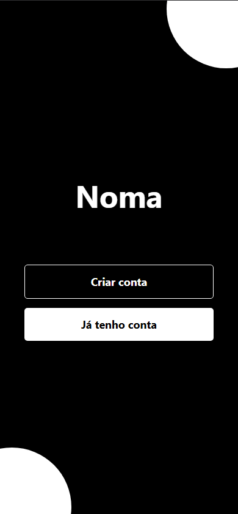
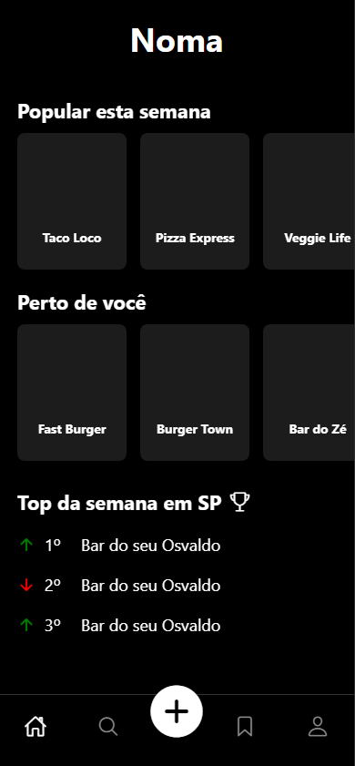
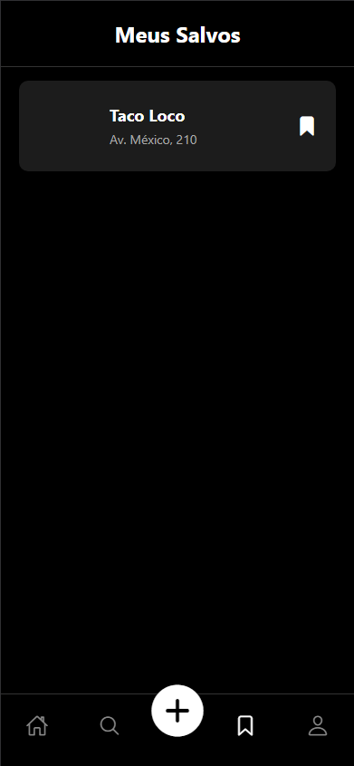
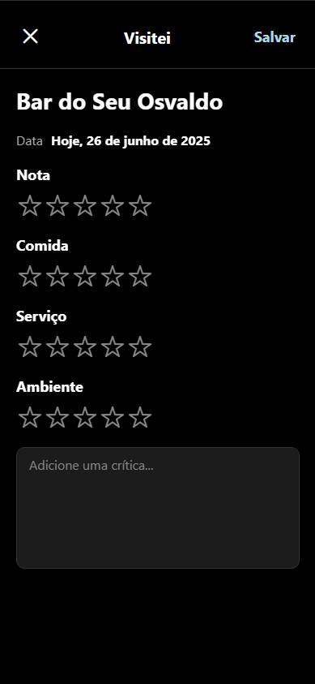
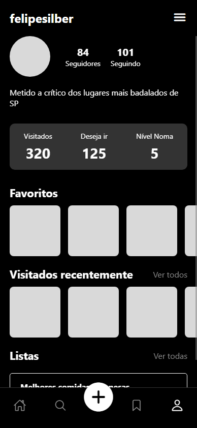

# Frontend Documentation – Noma Social Network

## Introduction

This frontend was developed as part of the **MVP (Minimum Viable Product)** for the Noma social network. The primary goal was to create a **clean, intuitive, and functional mobile experience** for both iOS and Android platforms, built upon a **solid and maintainable codebase**.

The focus at this stage was to implement the **core user journeys**, ensuring that interactions such as navigation, data visualization, and content creation are **smooth, responsive, and aligned with the backend API**.

## Technologies Used

### React Native

A framework for building native mobile applications using JavaScript and React. It was chosen for its ability to **develop for iOS and Android from a single codebase**, significantly reducing development time and effort while maintaining high performance.

### Expo

A framework and platform built around React Native that simplifies the development process. Expo was used to **manage the project setup, handle native dependencies, and facilitate the build and deployment process**, allowing the team to focus on feature development.

### React Navigation

The standard library for routing and navigation in React Native applications. It was used to structure the entire user flow, including:

* **Bottom Tab Navigator:** For the main sections of the app (Home, Explore, Profile).

* **Native Stack Navigator:** To handle navigation between different screens, such as from a list to a detail view, and to manage the authentication flow.

* **Modal Stack:** For specific flows that should appear over the main content, like the "Add Review" process.

### Axios

A promise-based HTTP client for making API requests. Axios was chosen for its **simple and clean API**, making it easy to **communicate with the NestJS backend** to fetch and send data.

## Project Structure

The project's folder structure was designed for **modularity and scalability**, separating concerns to make the codebase easy to navigate and maintain.

```
/src
|-- /assets
|   |-- (images, fonts, etc.)
|-- /components
|   |-- (reusable components like buttons, cards)
|-- /navigation
|   |-- index.js (main navigation configuration)
|-- /screens
|   |-- /auth
|   |   |-- /login
|   |       |-- index.js
|   |       |-- styles.js
|   |-- /main
|   |   |-- /home
|   |   |-- /explore
|   |   |-- /profile
|   |   |-- /saved
|   |   |-- /place-detail
|   |   |-- /add-review
|   |       |-- /search
|   |       |-- /review
|-- /services
|   |-- api.js (Axios instance configuration)
|-- App.js (main entry point)
```

### Screens and Covered Features

The MVP covers the following screens and their main functionalities, providing a complete user experience for the core features.

| Screen | Main Features | 
| ----- | ----- |
| `Login` | Application entry point, allowing users to access the main platform. |
| `Home` | Displays dynamic content feeds, such as "Popular" and "Nearby" places. |
| `Explore` | Feature for searching and discovering new establishments. |
| `Profile` | Displays user information, statistics, and lists of favorites and reviews. |
| `Place Detail` | Shows detailed information about a specific establishment. |
| `Add Review` | A two-step modal flow for searching a place and submitting a new review. |
| `Saved Places` | A section to view places the user has saved. |

## Navigation Flow

The application's navigation is managed by a central `RootStackNavigator` which orchestrates the user's journey.

1. **Authentication Flow:**

   * Initially, the user is presented with the `Auth` stack, containing the `LoginScreen`.

   * Upon successful login, the navigation stack is **reset**, and the user is redirected to the `Main` flow, preventing them from going back to the login screen.

2. **Main Application Flow:**

   * The `Main` flow is controlled by a `BottomTabNavigator` (`MainTabs`), which provides access to the key screens: **Home**, **Explore**, **Saved**, and **Profile**.

   * A custom central button on the tab bar triggers a **Modal Stack** (`AddReviewFlow`), which opens on top of the current screen for adding a new review.

   * From the main screens, users can navigate to other stacked screens like `PlaceDetail`, which appear within the current flow.

This hybrid approach using stack and tab navigators ensures an intuitive and standard mobile UX.

## Functional evidences

### Login

<div align="center">
    <br>
    <span>Figure 1: Login page</span>
</div>

### Home

<div align="center">
    <br>
    <span>Figure 2: Home page</span>
</div>

### Saved Places

<div align="center">
    <br>
    <span>Figure 3: Saved places</span>
</div>

### Add Review

<div align="center">
    <br>
    <span>Figure 4: Add review</span>
</div>

<div align="center">
    <br>
    <span>Figure 5: Profile</span>
</div>


All the screenshots above were taken from the Noma project running locally.

## How to Run the Project Locally

**1. Clone the repository**

```
git clone [https://github.com/Inteli-College/2025-1A-T02-G55-INTERNO.git](https://github.com/Inteli-College/2025-1A-T02-G55-INTERNO.git)
```

**2. Install dependencies**

Navigate to the frontend directory and install the required packages.

```
cd app/frontend
npm install
```

**3. Start the application**

Run the Expo development server.

```
npm start
```

This will open the Metro Bundler in your browser. From there, you can:

* **Scan the QR code** with the **Expo Go** app on your physical iOS or Android device.

**The application will be available for development and testing on your chosen device/simulator.**


## Next Steps

The primary focus for the upcoming development sprints is to transition Noma from its current state into a fully functional, stable, and testable Minimum Viable Product. The plan is structured in distinct phases, from final frontend development to authentication.

1. Finalizing Frontend Development
While the main screens are structured, the focus will be on polishing the user experience and completing all interaction flows.

UI/UX Refinement: Adjust layouts, typography, and component styles across all screens to ensure a consistent and visually appealing interface.

State Management: Solidify the management of local and global states, especially for data that is shared between screens.

Full Responsiveness: Ensure the application adapts gracefully to different screen sizes and device orientations.

2. Full Backend Integration
The core technical task is to replace all static and mock data in the frontend with live data fetched from the NestJS API.

Dynamic Data Loading: All feeds (Home screen), user details (Profile screen), and lists will be populated by API calls.

Search Functionality: The Explore screen's search bar will be connected to the /place/search endpoint to provide real-time results.

Data Submission: Forms for creating reviews and saving places will execute POST requests to the backend, with proper handling of success and error states.

3. Authentication Implementation
The login flow will be fully integrated with a secure authentication service to manage user sessions.

Firebase Authentication: Connect the Login and "Create Account" screens to Firebase, handling user registration, sign-in, and session management.

Token Handling: Implement the logic to store and refresh authentication tokens securely on the device.

Protected Content: Ensure that user-specific data (e.g., profile, saved places) is only accessible after a successful login.