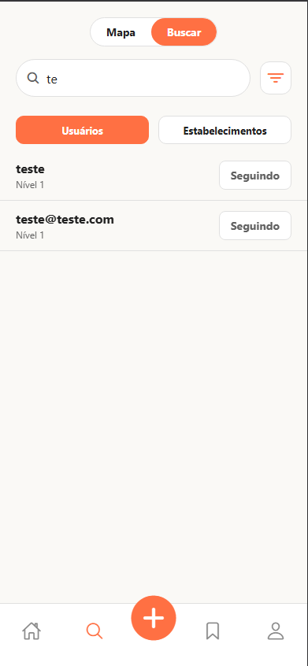
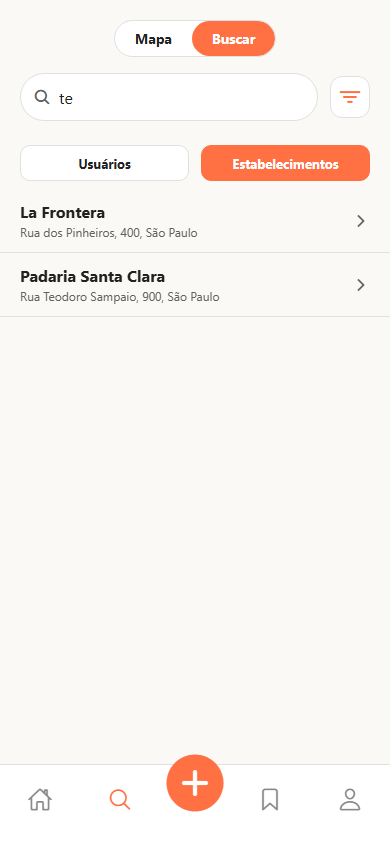
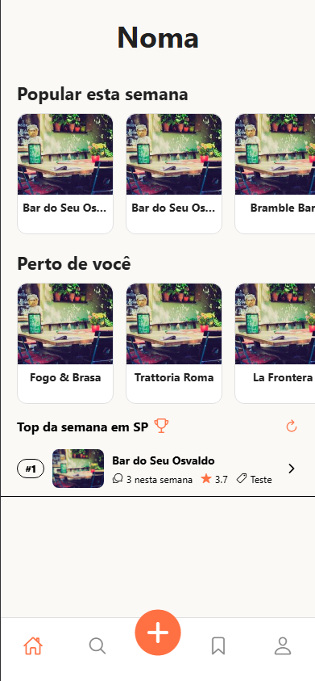
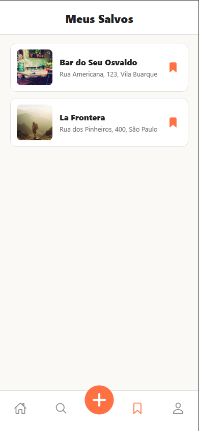
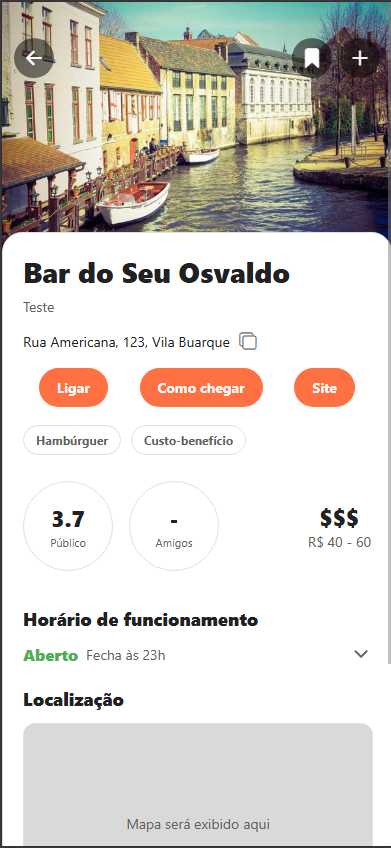
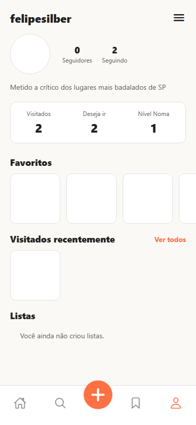
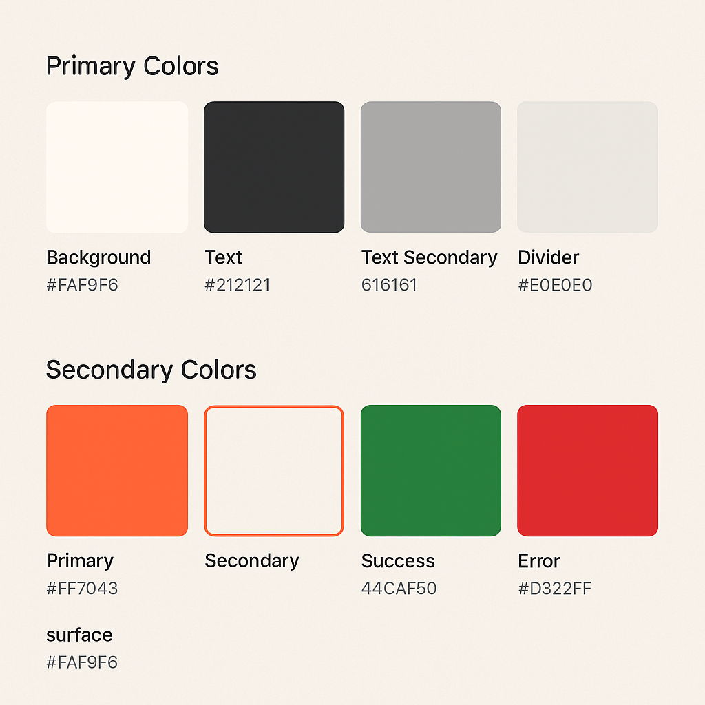

# Introduction

This sprint continued the end-to-end development of the application, consolidating core social and discovery features while initiating a UX refinement cycle. The work centered on: integrating the **follow user** domain, implementing and wiring the **Explore** page (searching by users and by places), building and integrating the **Ranking** experience, integrating the **Saved Places** page, completing the integration for the **Place Details** page, delivering the **Profile** page with a fully connected experience, and starting the overall **UX refresh** with a new color palette. The result is a product that is functionally broader and more cohesive across screens, with consistent data flows and a clearer visual identity.

# Backend Enhancements

On the server side, the sprint introduced and stabilized the core relationships and queries necessary to power the new social and discovery surfaces. The follow/unfollow domain was designed to be idempotent, ensuring that the same follow action cannot be duplicated and that unfollow is safe to repeat. To support this, the user model now persists both inbound and outbound relationships, enabling efficient retrieval of “followers,” “following,” and counts without recomputation on every request. In addition, validations were aligned to prevent self-follows and to standardize error reporting for client consumption.

For discovery, queries were exposed to allow exploring users and places with consistent pagination, sorting, and defensive filtering. The Explore endpoints were structured to return lightweight view models, reducing payload size and avoiding N+1 queries. The Ranking surface relies on a consolidated set of read-optimized queries, which aggregate engagement signals in a predictable manner and return stable, page-friendly results that are resilient to spikes in traffic. Besides, Saved Places were modeled as a user-to-place relationship with clear semantics for creation, deletion, and retrieval; this enabled a seamless “save/unsave” flow and predictable listing, also with pagination.

The Place Details endpoint was standardized to deliver a single, coherent resource that includes core metadata (e.g., name, address, imagery), derived counters (e.g., saves), and the current user’s relationship state (e.g., isSaved). Nevertheless, response envelopes and status codes were normalized across modules to simplify client integration, and DTO shapes were formalized so that the Profile page could fetch the full set of required data (bio, counts, relationships, and lists) in a small number of calls. Altogether, the backend now presents a uniform, predictable interface that reduces coupling and accelerates client development.

# Frontend & Integration

## Follow and Explore

On the client side, the sprint delivered and wired the principal journeys introduced during this cycle. The **Follow** mechanism (Figure 1) is now available directly from user profile headers and from user cards in lists, with immediate button state transitions and optimistic UI where appropriate. The **Explore** (Figure 2) page was conceived to support two discovery modes—by users and by places—so that the user can seamlessly switch between them. Search, empty states, and loading indicators were unified, and navigation flows from Explore into Profile and Place Details were completed with consistent back behavior.

<table>
  <tr>
    <td align="center">
       
      Figure 1: Follow user
    </td>
    <td align="center">
       
      Figure 2: Explore places
    </td>
  </tr>
</table>

## Home, Saved Places and Place Details

The **Home** page (Figure 3) presents a consolidated leaderboard based on engagement metrics, with stable list virtualization and predictable sorting. Row actions (e.g., follow, view details, save place) were aligned to behave consistently across ranking, explore, and profile contexts. The **Saved Places** page (Figure 4)exposes the user’s saved items with a straightforward list that supports unsave operations in context and updates the UI immediately. The **Place Details** page (Figure 5) now consumes the standardized backend shape and renders imagery, essential metadata, derived counters, and the save/unsave control in a single, cohesive layout.

<table>
  <tr>
    <td align="center">
       
      Figure 3: Home
    </td>
    <td align="center">
       
      Figure 4: Saved Places
    </td>
    <td align="center">
       
      Figure 5: Place Details
    </td>
  </tr>
</table>

## Profile

The **Profile** page (Figure 6) integration was completed, now displaying identity information, counters (e.g., followers, following and user level), and navigable lists to drill into followers/following and user-related places. Error and loading states were harmonized throughout, and a consistent approach for empty content states was established so that the application feels predictable, regardless of the user’s data density.

<table>
  <tr>
    <td align="center">
       
      Figure 6: Profile
    </td>
  </tr>
</table>

# UX Refinement (Palette & Consistency)

This sprint inaugurated the broader UX refresh by introducing a **new color palette** and applying it to primary, secondary, and background surfaces. The palette was selected to improve contrast, accessibility, and brand recognition while providing sufficient tonal steps for states such as hover, active, and disabled. Buttons, tabs, and key call-to-action areas now use the updated tokens so that interactive elements are visually distinct and consistent across screens.

Beyond color, spacing, typography scales, and card compositions were aligned, reducing visual noise and creating clearer information hierarchies. Empty, loading, and error states received uniform treatments, ensuring that users can quickly parse system feedback. While this refinement cycle has begun, the intent is to propagate the palette (Figure 7) and spacing rules to the remaining components and micro-interactions in the next sprint, thereby achieving a fully cohesive visual system.

<table>
  <tr>
    <td align="center">
       
      Figure 7: Color Palette
    </td>
  </tr>
</table>

# Next Sprint: Toward Feature-Complete

The next sprint will focus on **bringing the application to feature-complete status**, with the following key points to be achieved:

- Finalize remaining UX refinements by applying the new palette and spacing rules to all screens and edge cases.
- Close functional gaps in follow/explore/ranking flows (e.g., secondary filters, consistent deep-links, and shareable routes).
- Harden Saved Places and Place Details with improved empty states, and robust offline/poor-network handling where feasible.
- Complete Profile capabilities (e.g., additional sections and preferences), ensuring consistent counts and drill-downs.
- Stabilize performance with targeted pagination, query batching, and list virtualization improvements.
- Containerize the application using Docker to standardize environments and simplify deployment.
