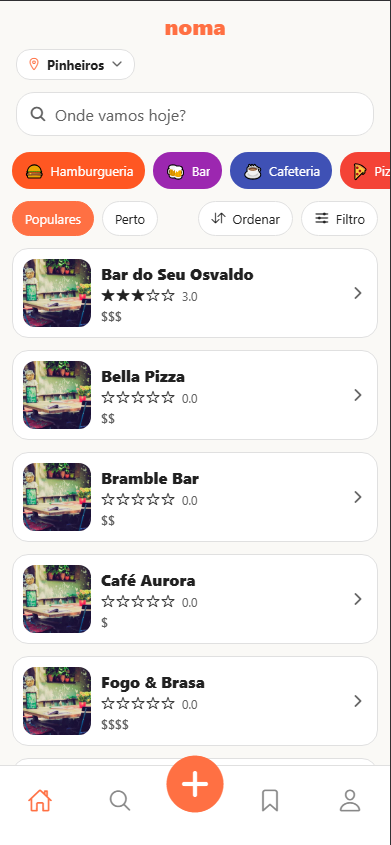
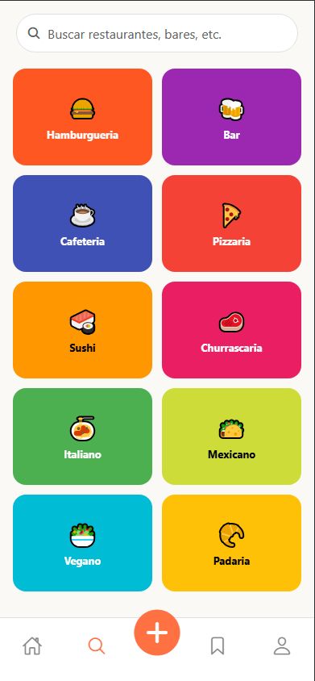
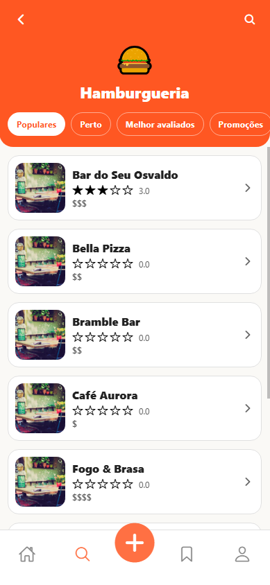

# Development Progress

## Introduction

This sprint advanced the redesign of key user-facing surfaces, with emphasis on repaginating the Home experience, overhauling the Search journey, and introducing a customized User Interface (UI) for creating reviews. In parallel, the application’s visual identity was consolidated through the selection and application of the chosen logo as the foundation for brand consistency. These changes elevate discoverability, expressiveness, and aesthetic coherence of the product while preserving stable data and navigation flows.

## Feature Enhancements

On the server side, no large new domains were introduced this sprint, but endpoints were extended and adjusted to support the evolving front-end features. Search queries were optimized to return lightweight place and user previews, ensuring responsive list updates. The review domain was scaffolded with endpoints for creation and retrieval, enforcing validation rules (e.g., non-empty body, rating range checks) and persisting author metadata for future profile integration.

By formalizing DTOs for these surfaces, the backend now provides predictable contracts for home feed composition, review submission, and search operations, reducing ambiguity for client development and ensuring extensibility for later review editing or moderation workflows.

### Home Page

The Home experience (Figure 1) was restructured to deliver a more engaging and organized entry point into the application. On the backend, endpoints were refined to supply place data optimized for the new two-column card layout and to support dynamic sorting and filtering. On the client side, the interface was repaginated, consolidating cards that highlight imagery, ratings, and quick actions such as saving or opening details. The header was also reconfigured: the logo is now centered, while the location element is positioned below, aligned to the left, creating a cleaner and more contextualized presentation. Together, these changes establish the foundation for a more scalable and user-friendly home feed.

     
    Figure 1: Home</a>

### Search Experience

The Search experience (Figure 2 and 3) was redesigned to provide faster access to relevant places and categories. On the backend, endpoints were extended to support both keyword queries and category-based exploration, returning optimized payloads with essential attributes such as name, rating, and location. The responses were structured to minimize latency and to ensure compatibility with sorting and filtering operations.

On the frontend, the interface was refined to emphasize usability and efficiency. A streamlined search bar now anchors the top of the screen, paired with quick-access filters and sorting options that allow results to be refined without leaving the page. Results are displayed in a list with consistent card layouts, showing imagery, ratings, and key information in a compact format. Visual hierarchy was improved through typography, spacing, and iconography adjustments, ensuring that critical details stand out immediately.

<table>
  <tr>
    <td align="center">
       
      Figure 2: Search Menu
    </td>
    <td align="center">
       
      Figure 3: Category Search
    </td>
  </tr>
</table>

Together, these changes transformed the search journey into a faster, more intuitive, and visually coherent process, reducing friction and aligning the experience with the broader visual identity established for the application.

### Create Review

The Review flow (Figure 4) received targeted UI and UX refinements to improve clarity and expressiveness. Custom icons were introduced for each rating level, replacing generic symbols with visuals that better communicate sentiment and make the evaluation process more intuitive. In addition, the establishment’s photo was positioned prominently at the top of the review screen, providing immediate context and reinforcing the connection between the feedback and its subject. These changes enhance the overall visual appeal of the review process, reduce ambiguity for users, and strengthen the sense of place identity within the interaction.

     
    Figure 4: Add Review</a>

### Visual Identity

During the sprint, the application’s visual identity was established through the selection of the definitive logo (Figure 5). This element now anchors brand presence in the app header, splash screens, and key surfaces, serving as the primary symbol of recognition. Typography, spacing, and card composition were adjusted to align with the logo’s style, ensuring that all components follow a consistent and recognizable aesthetic.

A unified visual identity is critical not only for aesthetic cohesion but also for strengthening brand recall, guiding user expectations, and improving overall usability. By presenting a consistent look and feel across screens, the interface becomes easier to navigate and more memorable, while reducing cognitive load for end users. This consolidation provides a foundation on which future refinements—such as expanded palettes, iconography, and micro-interactions—can be layered without losing coherence.

     
    Figure 4: Noma Logo</a>

### Next Steps

The upcoming sprint will place strong emphasis on testing and quality assurance, with the goal of ensuring that existing functionality is robust, stable, and reliable under real-world conditions. The focus will span three complementary layers of testing:

- **Unit tests:** designed to validate the smallest building blocks of the system in isolation. Services, helpers, and UI components will be covered individually so that core logic behaves as expected and remains stable even as new features are introduced.

- **Integration tests:** intended to verify that different modules—such as backend endpoints and frontend flows—operate correctly when combined. This will be especially important for scenarios like creating reviews, saving places, and navigating the repaginated home page, where multiple domains intersect.

- **Usability tests:** aimed at evaluating how real users interact with the redesigned home, search, and review creation flows. These tests will help identify friction points, confirm that the information hierarchy is clear, and validate that the identity system (logo, typography, spacing) is perceived as intended.

Establishing these layers of testing is critical at this stage. A systematic approach to quality assurance will:

- Detect regressions early, lowering the cost and effort of corrections.

- Increase confidence when refactoring or extending features.

- Provide a safety net that accelerates future releases.

- Ensure that end users experience a smooth, predictable, and accessible product.

This two weeks will not only expand test coverage but also institutionalize a quality-first approach, providing the foundation for sustainable growth and reliable iterations as the application advances toward a feature-complete state.
