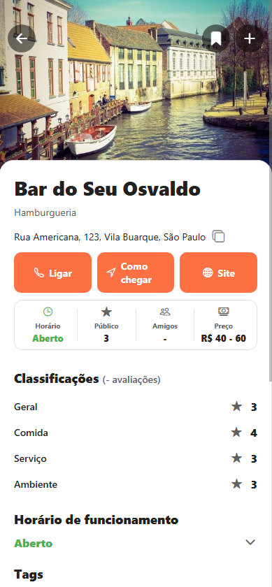
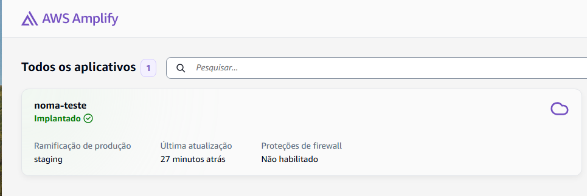
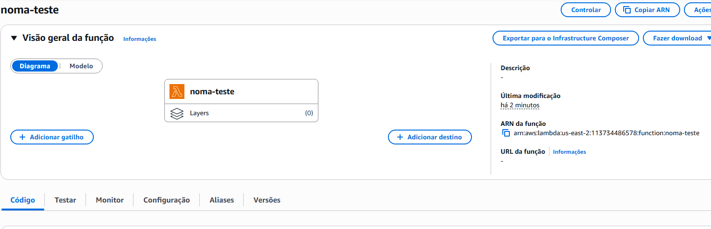
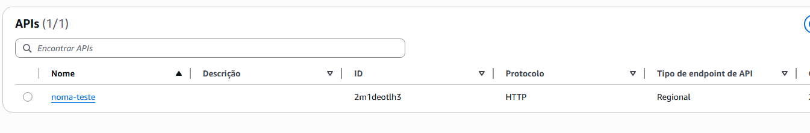
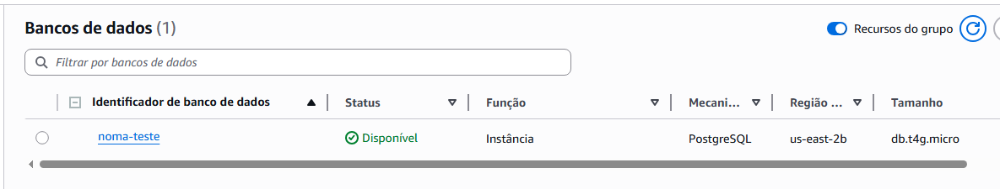
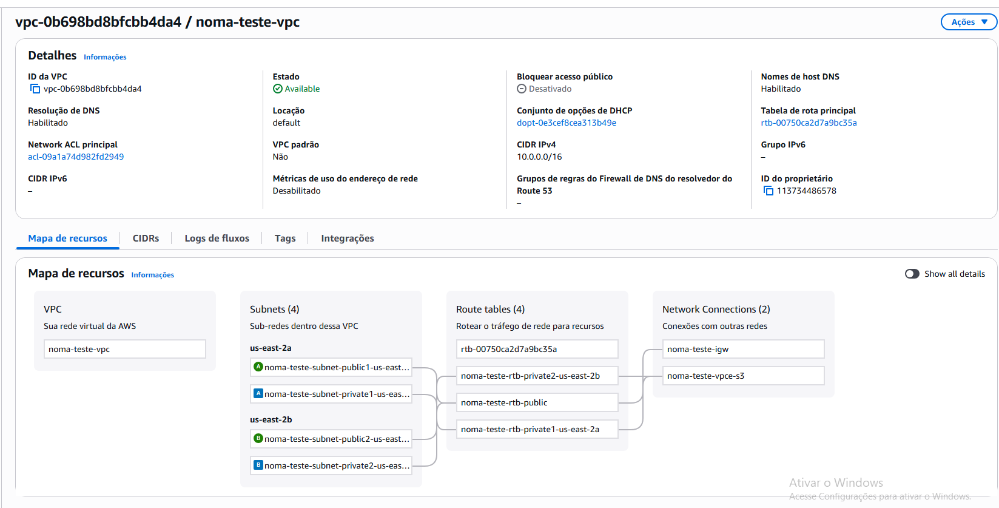

# Development and Cloud

## Introduction

Over the past two weeks, significant progress has been achieved in both the development and infrastructure setup of the project. On the development side, the establishment details page underwent a comprehensive redesign, aimed at enhancing user experience and visual clarity. This included a refined layout and the addition of new rating categories—food, service, and ambience—which were previously absent, resulting in a more complete and informative evaluation section. In parallel, substantial work was done on the deployment infrastructure, as the AWS services required for hosting the application were carefully structured and configured, laying the foundation for a reliable and scalable production environment. Altogether, these advancements mark a notable step toward the project’s completion, demonstrating consistent refinement of both functionality and technical readiness.

## Development and Design Enhancements

A major focus during this development cycle was the redesign and functional improvement of the establishment details page (Figure 1), which now delivers a more structured and engaging experience for users. The layout was reorganized to prioritize clarity and accessibility, ensuring that key information such as operating hours, average price, and user ratings are presented in a clean and visually coherent manner.

     
    Figure 1: Place Details enhancement</a>

One of the most impactful updates was the introduction of individual rating categories—Food, Service, and Ambience—which replaced the previous single composite score. This change allows users to better understand the specific aspects influencing an establishment’s overall reputation. Additionally, the presentation of these ratings was refined to include clear labels, star icons, and aligned values, resulting in a more intuitive and aesthetically balanced interface.

Together, these improvements not only enhance the visual appeal and usability of the page but also contribute to the project’s overarching goal of offering users a richer, data-driven view of each venue’s quality and atmosphere.

## Cloud Structure

From an infrastructure perspective, the last development phase was dedicated to structuring the cloud environment that will host and sustain the application in production. The chosen architecture leverages AWS services, combining scalability, cost efficiency, and seamless integration between components. This setup ensures that the system can handle increased workloads as the project grows while maintaining security, reliability, and low operational overhead. Below is a detailed overview of each selected service and its specific role within the deployment architecture:

**AWS Amplify (Frontend)**: AWS Amplify (Figure 2) was selected to host the frontend application, offering a streamlined and automated workflow for deployment directly from the project’s Git repository. It simplifies continuous integration and delivery (CI/CD) by automatically building and publishing the latest version of the app upon code updates. Amplify also provides global content delivery through Amazon CloudFront, ensuring fast load times and consistent performance for users worldwide. Its ease of configuration and low maintenance requirements make it ideal for rapid iterations and cost-effective hosting during development and production phases.

     
    Figure 2: AWS Amplify</a>

**AWS Lambda with API Gateway (Backend)**: for the backend layer, the combination of AWS Lambda (Figure 3) and API Gateway (Figure 4) was adopted to establish a fully serverless architecture. AWS Lambda allows code execution in response to HTTP requests without the need to manage servers, ensuring scalability and pay-per-use efficiency—resources are consumed only when invoked. The API Gateway acts as the secure entry point for all external requests, handling routing, authentication, and throttling. Together, they form a highly maintainable and cost-optimized backend stack, perfectly aligned with the project’s goal of minimizing infrastructure complexity.

<table>
  <tr>
    <td align="center">
       
      Figure 3: AWS Lambda
    </td>
    <td align="center">
       
      Figure 4: API Gateway
    </td>
  </tr>
</table>

**Amazon RDS (Database)**: the application’s data persistence layer is managed by Amazon Relational Database Service (RDS) (Figure 5). This service provides a reliable, scalable, and automatically managed SQL database environment, ensuring high availability through automated backups, monitoring, and multi-zone replication options. RDS offers a balance between performance and operational simplicity, enabling consistent and secure data access for both the backend services and analytical processes.

     
    Figure 5: Amazon RDS</a>

**Amazon VPC (Network Layer):** to reinforce security and network isolation, all components are organized within an Amazon Virtual Private Cloud (VPC) (Figure 6). This structure allows granular control over inbound and outbound traffic, subnet configuration, and routing policies. By defining private subnets for the database and controlled access for the application layers, the VPC ensures data protection and compliance with best security practices.

     
    Figure 6: VPC</a>

## Figma Update

During this cycle, special attention was also given to updating the Figma design files, which had fallen behind the latest iterations implemented in the product. The redesign of the establishment details page and other visual refinements introduced over the last two sprints were carefully documented and synchronized within the Figma workspace.

This update ensures that the design system accurately reflects the current state of the application, maintaining consistency between the UI mockups and the implemented interfaces. Additionally, it facilitates collaboration across development and design workflows by providing a single, reliable visual reference for future adjustments, usability testing, and stakeholder reviews.

With the design documentation now fully aligned, the project’s visual and functional coherence is reinforced—creating a stable foundation for the final UX improvements planned for the next sprint.

[Link do figma atualizado](https://www.figma.com/design/sqYUKuX8ZsqRrhEAI8iFGn/Wireframe-Noma?node-id=64-68&t=iQiKqIZBYhTrR0is-1)

## Next Steps

As the project approaches its final phase, the development effort is increasingly centered on refinement and polish. Many elements are now undergoing iterative adjustments to improve consistency, performance, and visual cohesion across the platform. This stage is less about introducing new functionality and more about ensuring that every component aligns seamlessly with the overall user experience and technical standards defined throughout the project.

In the upcoming sprint, the main focus will be on enhancing UX and finalizing the application’s development. This includes refining navigation flows, improving responsiveness across devices, and optimizing interface feedback to ensure an intuitive and engaging user journey. These finishing touches will mark the transition from development to deployment readiness, consolidating both the product’s usability and its technical robustness for launch.
