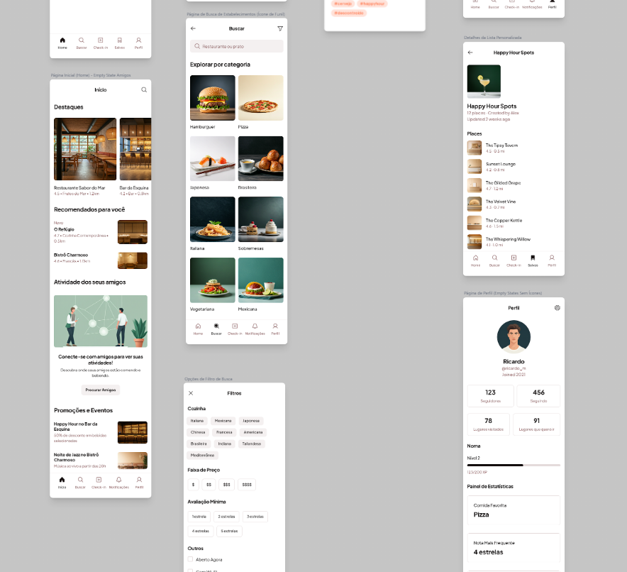

# UX Refinement

## Introduction

The last two weeks focused primarily on the refinement of the platform's user experience (UX). Consequently, the core objective guiding this sprint was to enhance overall usability while simultaneously aligning the user interface (UI) more closely with contemporary design standards and prevalent user expectations for modern social applications.

To achieve these goals, significant advancements were made across both the frontend and backend components of the platform. Specifically, frontend development involved substantial redesign and integration efforts across various core user flows, aiming for a more intuitive and visually consistent presentation. Concurrently, backend efforts concentrated on restructuring data models, optimizing service layer logic, and implementing the necessary API endpoints to effectively support these updated frontend functionalities and associated data requirements. The subsequent sections of this report provide a detailed breakdown of the specific tasks completed and features implemented during this period.

## UX Enhancement

A central achievement of this sprint was a comprehensive overhaul aimed at elevating the platform's overall user experience. This involved a significant visual redesign, resulting in a markedly more intuitive and modern interface deliberately structured to align with established usability patterns and aesthetic standards found in contemporary digital applications. The goal was to improve visual appeal and streamline user interaction flows.

Furthermore, this sprint introduced several key feature enhancements designed to enrich user engagement and expand the platform's social capabilities. Notably, users can now visualize friend activity directly on the home feed, providing immediate social context. The foundation for exploring and connecting with new people was also established with the creation of a dedicated landing page within the Explore section. Additionally, the user profile screen has been significantly enhanced with new statistics and gamification elements, offering deeper insights into user activity and progress. While not fully implemented in the frontend during this period, the backend was also prepared to support a dedicated view for list details, allowing users to manage and view their curated collections more effectively. These functional additions, combined with the UI repagination, contribute to a more robust, engaging, and modern user experience on the "Noma" platform.

All these changes and the brand new design can be seen on the images below (Figure 1 and 2):

<table>
  <tr>
    <td align="center">
       
      Figure 1: Figma 1
    </td>
    <td align="center">
       
      Figure 2: Figma 2
    </td>
  </tr>
</table>

## Frontend and Backend

Significant technical effort during this sprint was dedicated to implementing the revised user interface and ensuring the underlying systems could robustly support the new features and user experience goals. On the frontend, development involved the comprehensive integration of the new visual designs across key application screens, replacing previously static or mock-data-driven layouts with dynamic content fetched from the backend API, thereby enabling a truly data-driven experience for sections such as the home feed, user profiles, and place details. Furthermore, careful attention was paid to improving the perceived performance and responsiveness of the interface through the implementation of appropriate loading indicators, error handling messages, and informative empty states for lists and content sections, contributing to a smoother user journey. Structural improvements were also made, including the successful implementation of a global font system to ensure visual consistency throughout the application and necessary adjustments to the navigation architecture to accommodate the redesigned user flows, particularly within the Explore section.

Concurrently, substantial progress was made on the backend infrastructure to align with the frontend requirements and enhance overall system efficiency and maintainability. This involved a significant restructuring of the database schema, introducing new models for features like the activity feed and events while refining existing models for improved data organization and flexibility, such as the revised structure for handling place opening hours. Existing backend services, including those responsible for managing places and user data, underwent considerable refactoring to optimize data retrieval processes, notably leveraging database-level aggregations for calculating ratings and statistics, which significantly improves performance compared to application-level computations. Additionally, new dedicated services and corresponding API controllers were introduced for managing aggregated ratings and constructing the home feed, promoting better separation of concerns within the codebase and simplifying future development. Finally, robust database seeding scripts were developed, enabling efficient population of the database with realistic test data, which streamlines the development and testing cycles.

## Next steps

With the foundational UX/UI refinements and significant backend restructuring completed in this sprint, the immediate focus shifts towards finalizing the core functionalities required for the Minimum Viable Product (MVP) release of the app. The primary objective for the upcoming period is to achieve feature completion for the essential user journeys, ensuring a stable and cohesive initial product offering.

Key development activities will include integrating the remaining frontend sections, currently utilizing mock data, with their corresponding backend API endpoints; this includes completing the implementation for displaying detailed opening hours, tags, and the full user reviews list on the Place Details screen, as well as connecting the Promotions & Events section on the Home Feed. Furthermore, development will commence on essential features that were planned but not fully implemented in this sprint, such as the List Details page and the initial version of the Explore People functionality. Furthermore, preparation for the initial deployment of the MVP will also begin, encompassing environment setup and necessary build configurations. The overarching goal is to consolidate the progress made and deliver a polished, functional MVP ready for launch and for the final pitch.
