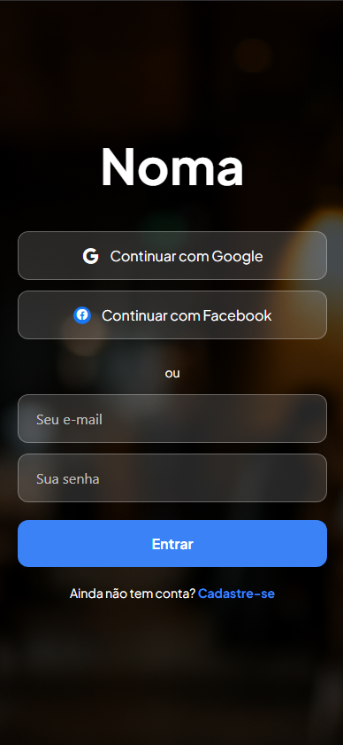
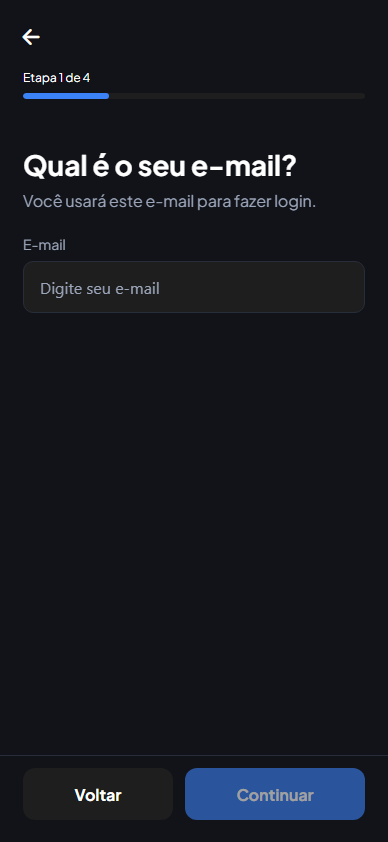
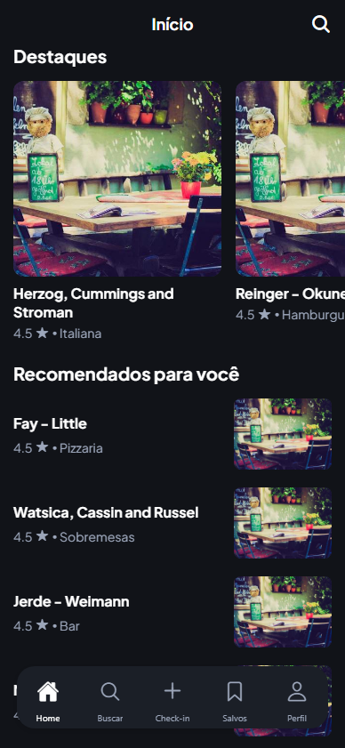
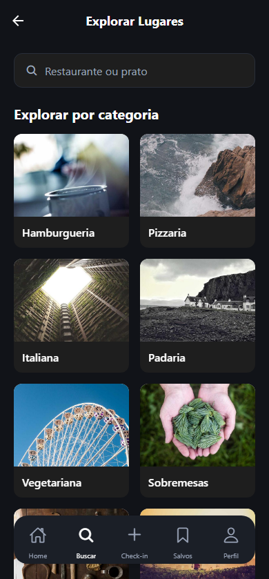
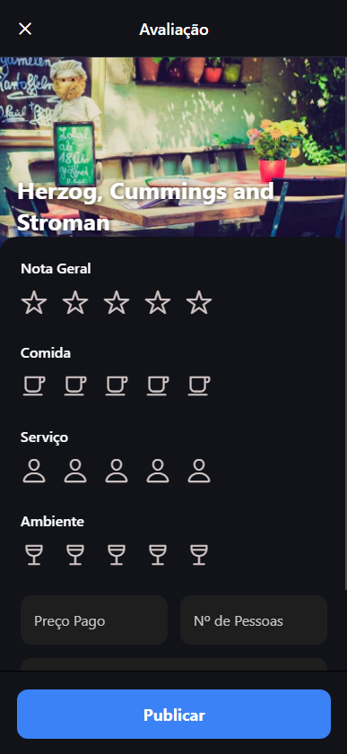
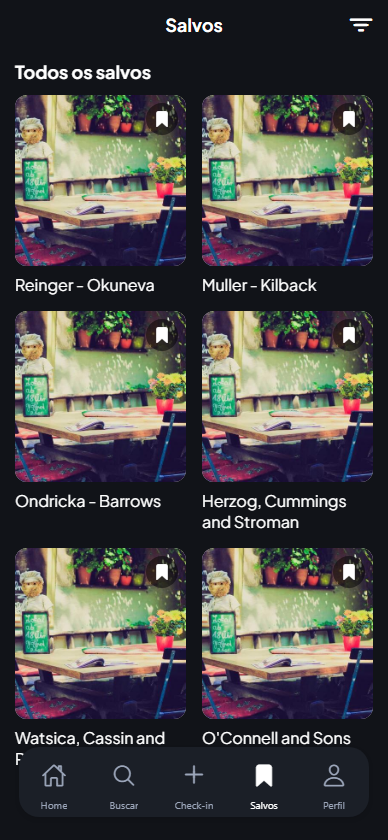

# Development Conclusion

## Introduction

During the last two weeks, work was directed at fully finalizing both the application and its design. New end-to-end flows were constructed to complete critical user journeys; a unified feedback system with in-app notifications was introduced to provide immediate and consistent confirmation; and previously available flows were refined to improve clarity, responsiveness, and visual consistency. In parallel, API contract standardization and design-system alignment were completed to ensure coherence across layers. Consequently, the product now presents a functionally complete experience with predictable interactions and a stable foundation for release and subsequent validation.

## Login

The authentication journey begins upon application launch whenever no valid session is present; otherwise, the existing session is restored seamlessly. Users may either sign in with existing credentials (Figure 1) or create a new account (Figure 2) by providing the required minimal information. Upon successful authentication, an ID token is retrieved and, consequently, attached to subsequent requests to authorize protected operations. Throughout the process, a notification-based feedback system communicates success (e.g., session established) and failures (e.g., invalid credentials, network errors), thereby ensuring clarity and immediate remediation guidance. Session persistence and token renewal occur transparently, whereas explicit sign-out invalidates the current session and redirects to the entry point.

<table>
  <tr>
    <td align="center">
       
      Figure 1: Login
    </td>
    <td align="center">
       
      Figure 2: Sign up
    </td>
  </tr>
</table>

## Initial Feed

The initial feed (Figure 3 and 4) loads automatically on entry by fetching the home endpoint and presents a curated overview of content across distinct sections. A centered header identifies the surface, while a search icon in the header allows direct navigation to the exploration landing. During data retrieval, a loading indicator is displayed; if a failure occurs, an error message is shown alongside a clear retry action, thereby avoiding dead ends. Once loaded, the feed exposes:

- Highlights: a horizontally scrollable gallery of featured places; tapping any card navigates to the corresponding place details.
- Recommended for You: a vertically arranged list of recommended places with imagery, rating, and category; tapping navigates to place details.
- Friends’ Activity: a preview of recent actions by friends; if no activity is available, a call-to-action invites the user to discover and connect with people, deep-linking to the people exploration surface.
- Promotions and Events: a concise list of promotional items and events to stimulate timely discovery.

<table>
  <tr>
    <td align="center">
       
      Figure 3: Home 1
    </td>
    <td align="center">
       
      Figure 4: Home 2
    </td>
  </tr>
</table>

## Explore

The exploration journey begins at a dedicated landing surface (Figure 5) from which users choose between discovering places or people, thus turning the home header’s search affordance into a structured entry point. From this bifurcation, two complementary paths are available:

- Explore Places (Figure 6)
  - Category Grid: a visually guided grid fetches categories from the API and presents them with imagery; selecting a category opens a scoped results view.
  - Category Details with Tabs: within a chosen category, results are organized by tabs—Popular, Nearby, and Friends—so that users can prioritize relevance, proximity, or social context. Lists are efficiently rendered and, upon selection, navigate deterministically to place details.
  - Search Affordance: a search bar is present to prompt targeted discovery within the places context, maintaining consistency with the broader exploration model.

- Explore People (Figure 7)
  - Username Search: a debounced search input allows users to look up profiles by username, returning lightweight previews that preserve responsiveness and predictability.
  - Curated Sections: Popular Users, Active Users, and People You May Know provide immediate social discovery, complementing direct search and enabling low-effort exploration.
  - Follow and Profile: follow/unfollow can be toggled directly from cards, while opening a profile transitions with preserved context and consistent back behavior.
  
<table>
  <tr>
    <td align="center">
       
      Figure 5: Explore Menu
    </td>
    <td align="center">
       
      Figure 6: Explore Places
    </td>
    <td align="center">
       
      Figure 7: Explore People
    </td>
  </tr>
</table>

## Create Review

The review flow (Figure 8) can be initiated from a place details page or via contextual entry points. Users are invited to rate multiple dimensions—such as food, service, and ambience—while also providing optional textual feedback. Validation rules ensure completeness and coherence (for instance, rating ranges and non-empty critical fields); errors are presented inline, while confirmations are delivered through notifications once the submission succeeds. Additionally, users may discard drafts with explicit confirmation, edit inputs before submission, and, where applicable, attach contextual information to reinforce trust. Upon completion, the review propagates to the relevant surfaces (e.g., profile and place details), and the interface returns with state updated accordingly.

<table>
  <tr>
    <td align="center">
       
      Figure 8: Add Review
    </td>
  </tr>
</table>

## Saved Places

The saved places surface (Figure 9) offers a consolidated view of bookmarked locations, supporting quick access, removal, and navigation to details. Lists are paginated and, furthermore, reflect changes instantly to avoid mismatches between user intent and displayed state. In contexts where saving/unsaving is triggered from other pages (e.g., feed or explore), the saved list stays consistent due to unified data contracts and optimistic updates. Notifications confirm each action and, in case of failure, provide a clear explanation and a non-intrusive option to retry. Empty and loading states are articulated with precise messages, ensuring that users understand the system status at all times.

<table>
  <tr>
    <td align="center">
       
      Figure 9:Saved Places
    </td>
  </tr>
</table>

## Profile

The profile aggregates identity information, activity summaries, and social connections, thereby enabling a comprehensive yet focused view of the user context. From this surface, it is possible to access followers and following lists, inspect saved places, and review recent contributions. Furthermore, navigation from the profile to related entities (e.g., place details or user lists) is consistent and reversible, preserving the user’s exploration path. Edits to profile attributes (where permitted) are validated and confirmed through notifications, whereas follow/unfollow operations provide immediate visual and textual acknowledgment. Consequently, the profile serves both as a personal hub and as a gateway to deeper discovery, maintaining coherence with the broader interaction model.

<table>
  <tr>
    <td align="center">
       
      Figure 10: Profile
    </td>
  </tr>
</table>

## Next Steps

 In the coming weeks, the primary focus will be the complete deployment of the platform so that the MVP becomes fully available on mobile devices. Concretely, this includes finalizing the build and distribution pipelines (continuous integration and delivery for Android and iOS), managing environment variables and secrets, and configuring the production backend (infrastructure provisioning, domain and SSL, and controlled scaling). In addition, mobile distribution will be prepared through appropriate channels, accompanied by monitoring, crash reporting, and performance analytics to ensure operational reliability and fast diagnosis of issues.
 
 In parallel, the final pitch and accompanying documentation will be constructed. The pitch will articulate the problem statement, value proposition, product narrative, and a concise live demonstration path, complemented by a near-term roadmap. The documentation set will consolidate the technical architecture, API contracts, environment setup, and runbook for deployment and incident response, as well as a brief user guide and the testing evidence gathered during development. Together, these deliverables will support a credible MVP release and provide stakeholders with a clear view of product readiness and next milestones.